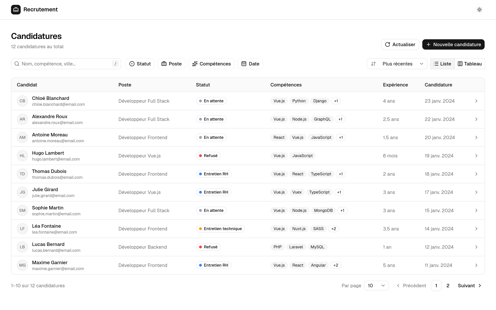
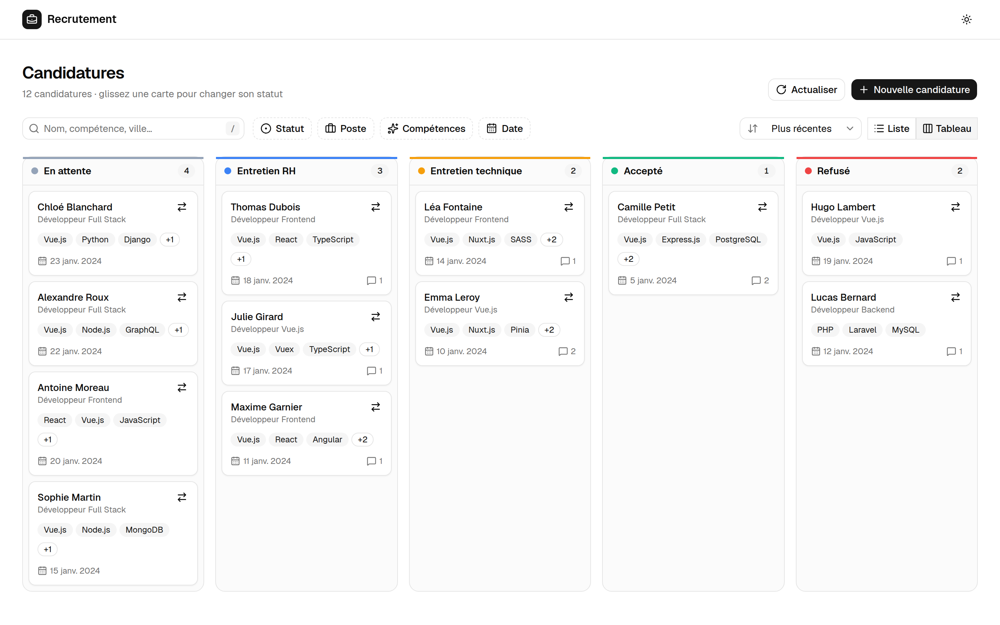
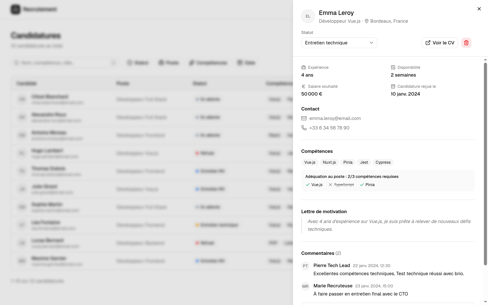
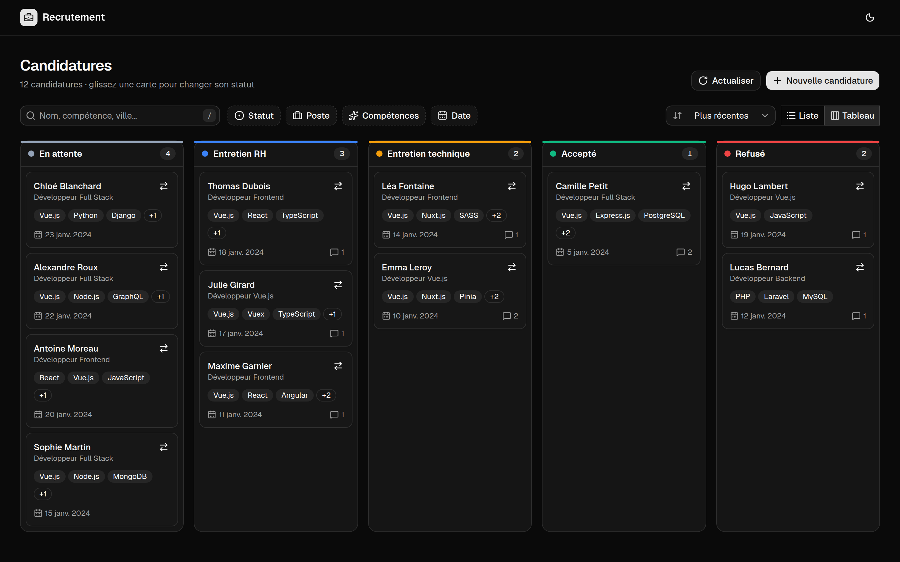
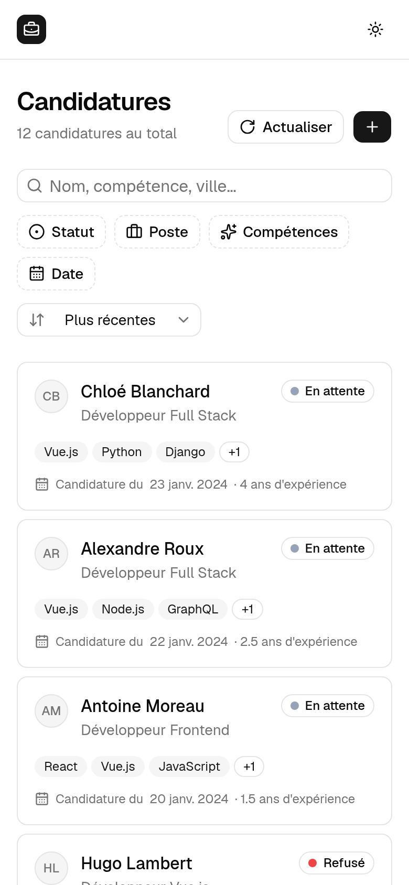

# Gestion des candidatures

Interface de suivi des candidatures pour une équipe de recrutement : liste filtrable et paginée,
board Kanban par statut (drag & drop), détail d'une candidature, commentaires.

Application **Vue 3 + TypeScript** qui consomme exclusivement l'API REST de **JSON Server**.
Aucune donnée n'est hardcodée : statuts, postes, compétences et candidatures viennent de l'API.

| Liste                                    | Board Kanban                                |
| ---------------------------------------- | ------------------------------------------- |
|  |  |

| Détail d'une candidature               | Dark mode                                                  | Mobile                                           |
| -------------------------------------- | ---------------------------------------------------------- | ------------------------------------------------ |
|  |  |  |

## Démo en ligne

> 🔗 **URL à compléter après le déploiement**

L'application et l'API sont hébergées ensemble sur [Render](https://render.com) (offre
gratuite), par un seul service Node (`server.js`) :

| Chemin                               | Contenu           |
| ------------------------------------ | ----------------- |
| `/`                                  | L'application     |
| `/api/candidatures`, `/api/statuts`… | L'API JSON Server |

Les appels API sont visibles dans l'onglet **Network** des DevTools du navigateur.

À savoir :

- **Premier chargement lent.** Le service se met en veille après une période sans visite : le
  réveil prend de 30 à 60 secondes.
- **Données remises à zéro** à chaque redémarrage du service, à partir des données fournies.
- **Données partagées** entre tous les visiteurs.

Pour lancer la même version en local :

```sh
pnpm build
pnpm serve      # application + API sur http://localhost:3000
```

## Démarrage

Prérequis : Node.js `^22.18.0` ou `>=24.12.0`, et [pnpm](https://pnpm.io/).

```sh
pnpm install
pnpm start
```

`pnpm start` lance **l'API et l'application ensemble** :

| Service         | URL                   |
| --------------- | --------------------- |
| Application     | http://localhost:5173 |
| API JSON Server | http://localhost:3000 |

> ⚠️ **JSON Server est obligatoire.** Sans lui, l'application affiche « Serveur injoignable ».
> Avec `pnpm dev` seul, l'API n'est pas lancée.

### Lancer JSON Server séparément

```sh
pnpm api        # JSON Server sur le port 3000, à partir de db.json
pnpm dev        # l'application seule, dans un autre terminal
```

Vérification : http://localhost:3000/candidatures doit renvoyer la liste en JSON.

JSON Server est installé avec le projet (`devDependencies`) : aucune installation globale n'est
nécessaire. La version est fixée à **0.17.4** : la version 1 renomme les query params de pagination
et supprime la recherche `q`, utilisés ici.

### Remettre les données d'origine

JSON Server écrit chaque modification dans `db.json`. Pour retrouver les données fournies :

```sh
pnpm reset:db   # copie db.backup.json vers db.json
```

### Utiliser un autre port pour l'API

Si le port 3000 est occupé :

```sh
pnpm exec json-server --watch db.json --port 3001
```

puis créer un fichier `.env.local` (voir `.env.example`) :

```sh
VITE_API_URL=http://localhost:3001
```

## Commandes

| Commande          | Rôle                                                          |
| ----------------- | ------------------------------------------------------------- |
| `pnpm start`      | API + application                                             |
| `pnpm api`        | API JSON Server seule                                         |
| `pnpm dev`        | Application seule                                             |
| `pnpm reset:db`   | Restaure les données d'origine                                |
| `pnpm test:unit`  | Tests unitaires (Vitest)                                      |
| `pnpm type-check` | Type-check (`vue-tsc`)                                        |
| `pnpm lint`       | oxlint + ESLint                                               |
| `pnpm format`     | Prettier                                                      |
| `pnpm build`      | Type-check + build de production                              |
| `pnpm serve`      | Sert le build et l'API ensemble (version de la démo en ligne) |

## Fonctionnalités

### Demandées

- **Chargement via l'API** : candidatures, statuts, postes et compétences, avec états de
  chargement (skeletons), états vides et erreurs réseau avec bouton « Réessayer ».
- **Liste** : nom, poste, statut, compétences, expérience, date. Table sur desktop,
  cards sur mobile.
- **Filtres** par statut, poste, compétences (toutes / au moins une) et période, **recherche**
  en temps réel (avec debounce), **tri** et **pagination**. Tous passent par les query params
  de JSON Server.
- **Détail d'une candidature** dans un drawer, chargé par `GET /candidatures/:id` et ouvert par
  son URL (`/candidatures/3`), donc partageable. Changement de statut et ajout de commentaire par `PATCH`.
- **Gestion d'état avec Pinia**, préférences conservées dans `localStorage` : filtres, tri,
  vue préférée, taille de page, nom de l'auteur des commentaires, thème.

### Bonus

- **Drag & drop** entre colonnes pour changer le statut, avec une alternative au clavier
  (menu « Déplacer vers… » sur chaque card).
- **Optimistic updates** avec rollback en cas d'échec.
- **Création** (`POST`) et **suppression** (`DELETE`) d'une candidature.
- **Notifications** (toasts) de succès et d'erreur, avec action « Réessayer ».
- **Dark mode** (clair / sombre / système), appliqué avant le premier affichage.
- **Tests unitaires** avec mock des appels API.
- **Cache** des données de référence, annulation des requêtes obsolètes (`AbortController`),
  lazy loading de la vue Kanban.
- **Transitions** entre les vues, dans le fil des commentaires et à l'ouverture du drawer.

## Utilisation de l'API

| Besoin                 | Requête                                                                         |
| ---------------------- | ------------------------------------------------------------------------------- |
| Page de résultats      | `GET /candidatures?_page=1&_limit=10` (total lu dans le header `X-Total-Count`) |
| Tri                    | `_sort=dateCandidature&_order=desc`                                             |
| Recherche              | `q=vue`                                                                         |
| Statuts (plusieurs)    | `statut=En attente&statut=Refusé`                                               |
| Postes (plusieurs)     | `poste=Développeur Vue.js`                                                      |
| Compétences            | `competences_like=<regex>`                                                      |
| Période                | `dateCandidature_gte=…&dateCandidature_lte=…`                                   |
| Colonne du board       | une requête par statut : `statut=<statut>&_page=1&_limit=20`                    |
| Détail                 | `GET /candidatures/:id`                                                         |
| Changer le statut      | `PATCH /candidatures/:id` `{ "statut": "…" }`                                   |
| Ajouter un commentaire | `GET /candidatures/:id` puis `PATCH` `{ "commentaires": [...] }`                |
| Créer                  | `POST /candidatures`                                                            |
| Supprimer              | `DELETE /candidatures/:id`                                                      |
| Données de référence   | `GET /statuts`, `GET /postes`, `GET /competences`                               |

Deux points propres à JSON Server 0.17 :

- **Compétences.** `competences_like` est une regex appliquée à l'array des
  compétences. Les noms sont échappés (`Vue.js` contient un point) et délimités, pour que
  « Vue.js » ne corresponde pas à « Vue.js 2 ». Le mode « toutes » utilise une condition par
  compétence, le mode « au moins une » une alternative.
- **Dates.** Les dates sont comparées comme des strings. Les bornes envoyées sont le début et la fin
  du jour **local** choisi, convertis en UTC, pour que le filtre corresponde aux dates affichées.

## Organisation du code

```
src/
├── api/            Accès à l'API : client HTTP, requêtes, construction des query params
├── stores/         Pinia : candidatures, données de référence, préférences
├── composables/    Actions avec feedback utilisateur, breakpoint mobile
├── views/          Pages (une page pour la liste et le board, page 404)
├── components/
│   ├── candidatures/   Liste : table, cards, pagination, formulaire de création
│   ├── board/          Board Kanban : colonnes, cards, menu de déplacement
│   ├── detail/         Détail (drawer) : informations, statut, commentaires
│   ├── filters/        Recherche, filtres, tri
│   ├── common/         Éléments partagés : badges, états d'erreur, header de page
│   ├── layout/         Header de l'application, thème, choix de la vue
│   └── ui/             Composants shadcn-vue (générés)
├── lib/            Formatage, messages d'erreur, validation des liens
└── types/          Types du domaine
```

```
CandidaturesPage
├── PageHeader · RefreshButton · CreateCandidatureDialog
├── FiltersToolbar
│   ├── SearchInput · FacetFilter (statut, poste, compétences) · DateRangeFilter
│   └── SortSelect · ViewSwitcher
├── ListResults                       (requêtes paginées)
│   ├── CandidaturesTable / CandidaturesCards
│   └── ListPagination
├── BoardResults                      (une requête par statut, lazy loading)
│   └── BoardColumn → BoardCard → MoveToMenu
└── CandidatureDetailSheet            (route /candidatures/:id)
    └── CandidatureDetail → StatusSelect · CommentThread · CommentForm
```

## Choix techniques

| Choix                                               | Raison                                                                                                                                                                         |
| --------------------------------------------------- | ------------------------------------------------------------------------------------------------------------------------------------------------------------------------------ |
| **Composition API + `<script setup>` + TypeScript** | Logique réutilisable dans des composables, types vérifiés de l'API jusqu'aux composants.                                                                                       |
| **`fetch` plutôt qu'Axios**                         | Les besoins (timeout, annulation, erreurs typées) tiennent dans un client d'une centaine de lignes, sans dépendance.                                                           |
| **Couche API séparée**                              | Les composants et les stores ne connaissent ni les endpoints ni les query params de JSON Server.                                                                               |
| **State normalisé : candidatures stockées par id**  | La liste, le board et le détail ne gardent que des ids : une modification est visible partout, sans copie à synchroniser.                                                      |
| **Filtrage côté serveur**                           | Demandé par l'énoncé, et seul moyen de scaler avec beaucoup de candidatures.                                                                                                   |
| **Une page, deux vues**                             | La liste et le board partagent filtres et drawer de détail. Chaque vue charge ses données à sa façon : pages pour la liste, une requête par statut pour le board.              |
| **Board réservé aux écrans ≥ 768 px**               | L'intérêt d'un board Kanban est de voir toutes les étapes d'un coup d'œil, ce qu'un téléphone ne permet pas. Sur mobile, la liste et son filtre par statut couvrent le besoin. |
| **shadcn-vue + Tailwind CSS 4**                     | Composants accessibles (Reka UI) dont le code appartient au projet, thèmes light et dark par variables CSS.                                                                    |
| **vue-draggable-plus (SortableJS)**                 | Fonctionne au tactile, contrairement au drag & drop natif HTML5.                                                                                                               |

### Optimistic updates

- **Statut.** Le changement est affiché immédiatement, puis envoyé. En cas d'échec, la
  candidature reprend le dernier statut confirmé par le serveur et un toast propose de
  réessayer. Les changements d'une même candidature sont envoyés un par un, dans l'ordre : le
  serveur termine toujours sur le dernier choix.
- **Commentaire.** Il apparaît tout de suite avec la mention « Envoi… ». En cas d'échec, il
  reste affiché avec « Réessayer » et « Supprimer » : le texte saisi n'est jamais perdu.
- **Suppression.** La candidature disparaît immédiatement et revient à sa place en cas d'échec.
- **Création.** Pas d'optimistic update : l'id est attribué par le serveur. En cas d'erreur, le
  formulaire reste ouvert avec les valeurs saisies.
- **Race conditions entre lectures et écritures.** Une réponse de lecture partie avant une modification est
  ignorée pour cette candidature, même si elle arrive après.

### Gestion des erreurs

Le client HTTP traduit chaque échec en erreur typée, avec un message adapté :

| Cas                 | Message                                                |
| ------------------- | ------------------------------------------------------ |
| Serveur injoignable | « Serveur injoignable » + rappel de lancer JSON Server |
| Timeout (8 s)       | « Le serveur ne répond pas »                           |
| 404                 | « Élément introuvable »                                |
| 5xx                 | « Erreur du serveur »                                  |
| Réponse illisible   | « Erreur du serveur »                                  |
| Requête annulée     | ignorée (remplacée par une requête plus récente)       |

Quand un refresh échoue alors que des données sont déjà affichées, elles restent
visibles avec un avertissement.

### Accessibilité

- Navigation complète au clavier, skip link « Aller au contenu », touche `/` pour la recherche.
- Le drag & drop n'est jamais le seul moyen d'agir : menu « Déplacer vers… » sur chaque card.
- Labels ARIA pour les lecteurs d'écran, annonce du nombre de résultats, erreurs de formulaire
  reliées à leur champ, focus placé sur le premier champ invalide.
- Les statuts ne reposent pas sur la seule couleur : le nom est toujours affiché.

### Sécurité

- Le lien du CV n'est accepté et affiché que s'il commence par `http://` ou `https://`. Un lien
  `javascript:` enregistré par un autre client de l'API n'est jamais rendu cliquable.
- Les enregistrements incomplets reçus de l'API sont complétés par des valeurs par défaut : une
  donnée invalide n'empêche pas l'affichage des autres.

## Tests

```sh
pnpm test:unit
```

62 tests unitaires, sans appel réseau réel :

| Fichier                                     | Contenu                                                                                              |
| ------------------------------------------- | ---------------------------------------------------------------------------------------------------- |
| `src/stores/__tests__/candidatures.spec.ts` | Optimistic updates, rollback, ordre des requêtes, commentaires, suppression, pagination (API mockée) |
| `src/api/__tests__/http.spec.ts`            | Client HTTP : erreurs 404 / 500, réseau, timeout, annulation (`fetch` mocké)                         |
| `src/api/__tests__/query.spec.ts`           | Query params JSON Server : compétences, période, tri, pagination                                     |
| `src/api/__tests__/candidatures.spec.ts`    | Valeurs par défaut des enregistrements incomplets                                                    |
| `src/lib/__tests__/`                        | Formatage des dates, validation des liens                                                            |

## Hypothèses

- **Aucune règle métier sur les changements de statut** n'étant fournie, tous les passages d'un
  statut à un autre sont autorisés.
- **Pas d'authentification** : l'auteur d'un commentaire saisit son nom, conservé pour la suite.
- **Pas de réorganisation manuelle dans une colonne** : les données n'ont pas de champ de
  position, une colonne suit donc le tri choisi.
- L'**expérience** est un texte libre (« 6 mois », « 2.5 ans ») : elle est affichée mais ne sert
  pas de filtre, JSON Server ne pouvant pas la comparer.

## Limites connues

- **Commentaires simultanés.** Les commentaires sont stockés dans la candidature, et JSON Server
  ne sait pas ajouter un élément à un array : tout l'array est renvoyé. L'application relit
  les commentaires juste avant d'enregistrer, ce qui réduit le risque sans le supprimer : si deux
  recruteurs commentent au même instant, un commentaire peut être écrasé. La correction relève du
  serveur : une ressource `/commentaires` dédiée, ou un versioning à l'écriture (optimistic locking).
- **Pas de temps réel.** Les modifications d'un collègue apparaissent au prochain chargement ou
  après « Actualiser ».
- **Filtres non présents dans l'URL.** Ils sont conservés dans le navigateur : un lien
  partagé ouvre la bonne candidature, pas les mêmes filtres.
- **Adéquation au poste.** Certaines compétences requises des postes n'existent pas telles
  quelles dans la liste des compétences (« Express » et « Express.js », « CSS »). Seules les
  correspondances exactes, par nom ou par catégorie, sont comptées.

## Améliorations possibles

- Filtres et vue dans l'URL (query string), pour partager une recherche.
- Mises à jour en temps réel (WebSocket ou polling).
- Virtual scrolling pour la liste et infinite scroll dans les colonnes, pour de très grands volumes.
- Tests de composants et tests end-to-end (Playwright).
- Modification complète d'une candidature, annulation d'une suppression.
- Internationalisation (i18n) des labels.

## Utilisation de l'IA

Ce projet a été réalisé avec un assistant IA, **Claude Code** (Anthropic), utilisé dans le
terminal en pair programming. Par souci de transparence, voici où et comment.

### Ce que l'IA a produit

| Domaine       | Rôle de l'IA                                                                                                                                                                |
| ------------- | --------------------------------------------------------------------------------------------------------------------------------------------------------------------------- |
| Mise en place | Installation et configuration de Tailwind CSS 4 et shadcn-vue                                                                                                               |
| Code          | Écriture de la majeure partie du code : couche API, stores Pinia, composants, vues                                                                                          |
| Tests         | Écriture des tests unitaires, et vérifications dans un navigateur headless piloté par script (clics réels, drag & drop, mode offline simulé)                                |
| Debug         | Recherche de la cause et correction des bugs que je lui ai signalés                                                                                                         |
| Revue de code | Une revue automatisée de tout le projet, lancée à ma demande en complément de ma propre relecture                                                                           |
| Documentation | Rédaction de ce README, captures d'écran comprises, et des messages de commit                                                                                               |
| Hébergement   | Proposition de la solution (un seul service Node sur Render pour l'application et l'API), écriture de `server.js` et de `render.yaml`, test en local du build de production |

### Ce qui vient de moi

- **Le cadrage** : lecture de l'énoncé, choix de la stack et de shadcn-vue, ordre de
  réalisation (l'UI complète d'abord, les appels d'écriture ensuite).
- **Les décisions de conception**, parfois contre la proposition de l'IA :
  - retirer le board Kanban sur mobile, plutôt que l'adapter ;
  - une seule page pour les deux vues, chaque vue chargeant ses données à sa façon (pages pour
    la liste, une requête par statut pour le board) ;
  - un layout pleine largeur.
- **Les tests manuels** dans le navigateur, qui ont révélé des bugs que les vérifications
  automatiques n'avaient pas vues : vue blanche au changement de vue, overflow horizontal,
  reload de la page à chaque écriture de l'API, clic inactif sur la flèche d'une ligne.
- **La revue de code** : relecture du code produit par l'IA. J'ai aussi lancé une revue
  automatisée de tout le projet et demandé la correction de chacun de ses constats.
- **L'hébergement** : choix d'une démo en ligne plutôt que d'une vidéo, création du compte
  Render, publication du dépôt sur GitHub et déploiement.
- **La validation** : relecture des propositions et des explications avant de les accepter.

### Méthode

- J'ai demandé à l'IA d'**expliquer sa démarche avant de coder** sur les points délicats
  (optimistic updates, drag & drop), pour pouvoir la discuter et la justifier.
- Chaque correction a été **vérifiée** : tests unitaires, type-check, et contrôle
  dans un navigateur sur une copie de la base de données.
- Les limites sont documentées plutôt que masquées (voir « Limites connues »).

## Temps passé

Environ **5 h 30**, réparties sur deux sessions (28 septembre au soir, 29 septembre au matin).

> Ces durées sont des **estimations**, reconstituées à partir de l'historique Git et des dates
> des fichiers : je n'ai pas chronométré chaque partie. Elles s'entendent avec l'assistance
> d'une IA (voir « Utilisation de l'IA »), qui réduit nettement le temps d'écriture du code.

| Partie                                  | Temps estimé | Contenu                                                                                                                    |
| --------------------------------------- | ------------ | -------------------------------------------------------------------------------------------------------------------------- |
| Partie 0 : configuration                | 30 min       | Projet Vue, JSON Server et scripts, Tailwind CSS, shadcn-vue                                                               |
| Partie 1 : analyse et diagnostic        | 30 min       | Lecture de l'énoncé, essais des query params de JSON Server, choix de conception (optimistic updates, drag & drop, mobile) |
| Partie 2 : développement de l'interface | 2 h 45       | Liste, filtres, board Kanban, détail, puis création, suppression et optimistic updates                                     |
| Partie 3 : qualité du code              | 1 h 15       | Tests unitaires, recherche et correction de bugs, code review et corrections                                               |
| Documentation                           | 30 min       | README et captures d'écran                                                                                                 |
| **Total**                               | **≈ 5 h 30** |                                                                                                                            |
